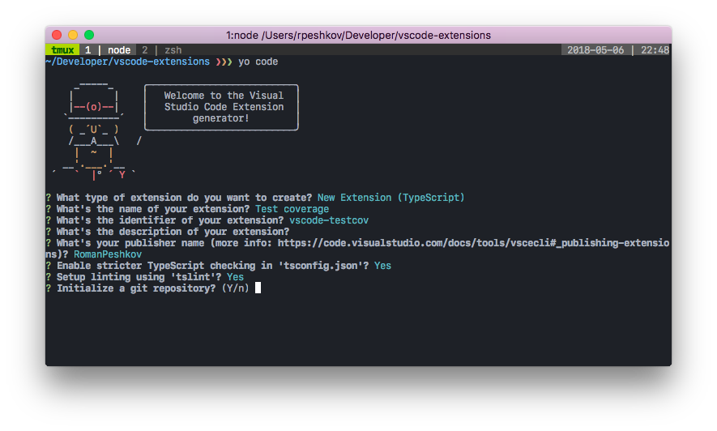
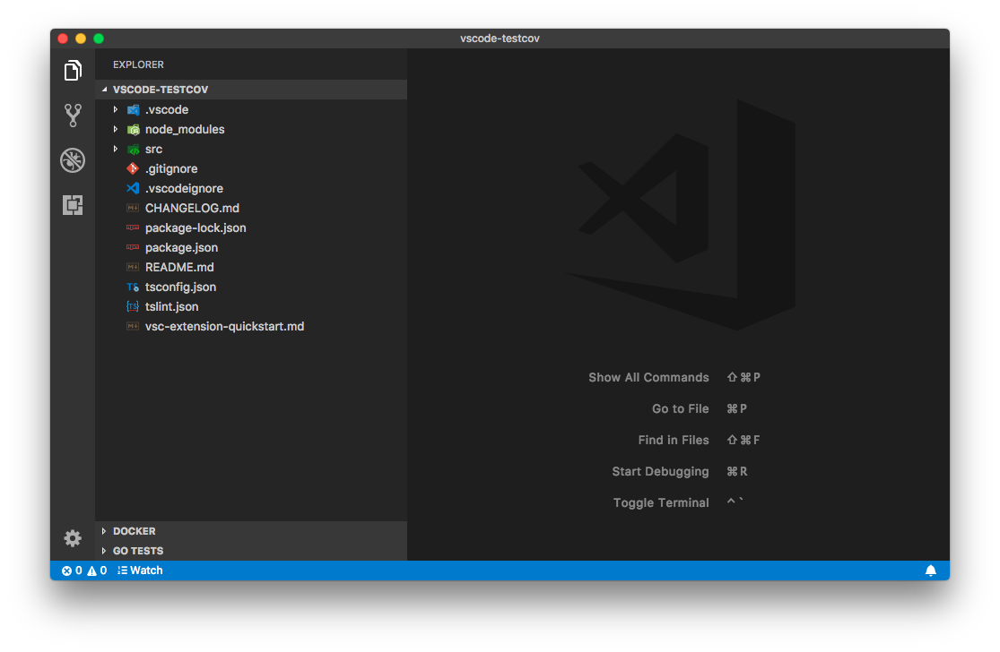

+++
title = "VSCode extension code coverage"
date = 2018-05-06T22:38:35+02:00
draft = true
tags = ["vscode"]
+++

In this article I'll show you how to add code coverage info for you Visual Studio Code extension code. We'll start from the very beginning and in the end you'll have working extension with code coverage metrics setup.

## Creating extension

Creating extension is fairly simple. We'll start from the default code that's generated by Yeoman's generator for VSCode.

Open your terminal and type `yo code` in it. You can leave all the values to their defaults. Here what I used for generating extension:



After last question about initializing git repository, generator will install scaffold extension code and install all the required npm packages. Now you can navigate into the extension's folder and open it in VSCode:

```
cd vscode-testcov
code .
```



Just in order the check that everything is fine, try to launch tests for your new extension. If everything is fine, you should see similar picture in your debug console:


